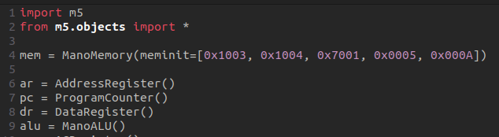
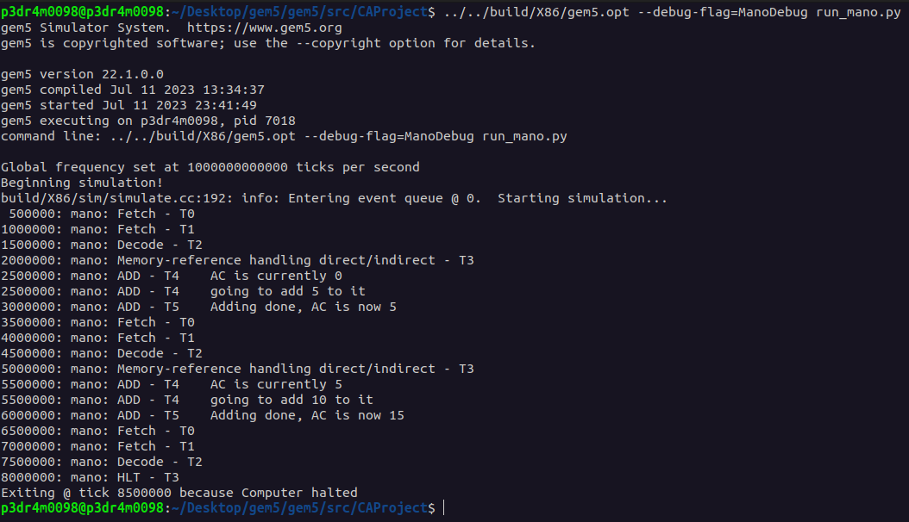

# Designing and Implementation of Mano Machine in gem5

* The files implemented for this project are located in **gem5/src/CAProject**; you should add these to your own gem5 setup on your local machine in order to use it.

## Description

This project focuses on designing and implementing the Mano Machine using the gem5 simulator. The Mano Machine, a simple computer architecture, that represents a simple multi-cycle processor. By utilizing gem5, we aim to simulate the execution of instructions and evaluate the behaviour of the Mano Machine inside gem5 environment.

Using this project, you can simulate running a program that is designed for the Mano Machine ISA, and see what steps the machine goes through in order to achieve the execution of the defined program.

## Features

- Implementation of the required components and the machine itself as SimObjects including: (You can find the SimObject names in the SConscript file.)

    - Registers (such as ACRegister, AddressRegister, etc.)
    - ManoALU
    - ManoMemory
    - ManoMachine (which represents the functionality of the control unit)

- Simulation of various possible instructions and their performance analysis
- Observation of the processor's instruction execution route behaviour given a Program


## How to Use
If you need to know about the parameters of each class, make sure to check out the SimObject definition files before proceeding.

Then to use this project, follow these steps:

1. Make sure you have an installation of gem5 simulator (preferably the latest version) following the official documentation.

1. Clone the project code from repository onto your local machine, and copy the content of **gem5/src/CAProject** to your gem5 files accordingly.

1. Build the project files according to your host system ISA, using the following command: (within the root of your gem5 directory)

    ```bash
        scons build/{ISA}/gem5.opt -j$(nproc)
    ```
   
1. Make the modifications you need in the configuration script file (run_mano.py), such as changing the program for the machine through changing the meminit parameter of the memory.\
\
You can also initialize registers with values other than 0, such as initializing the PC register with 2, while you would want to allow for an implementation of an interrupt cycle routine. (as you would need to leave the 2  first cells of memory for that)
 

1. Using the gem5.opt binary you just built, you can run the script; If you want to see the debug messages, you should use the debug flag **ManoDebug**. 

    ```bash
        {pathToBinary}/gem5.opt [--debug-flag=ManoDebug] {pathToConfig}/run_mano.py
    ```
    
## Usage Example

Now that we have discussed how you should be able to use the project, let's consider an example:

1. First, in the configuration script we initialize the memory with a Mano Machine assembly program that is used to add numbers 5 and 10. We achieve this by Executing the ADD instruction, twice, once with the address of the memory that holds the operand 5, and once again we do that for the operand 10. And finally, we halt the computer.

    
    
    Each of the 0x1{address} values represents an _ADD {address}_ instruction, and the 0x7001, represents the HLT instruction; the other values represent the data (5 and 10). 
1. Now if we run the simulation, using our built gem5 binary, with debug flags set, we get the following simulation output:
    
    
    
    **Notice**: for the sake of this example, extra DPRINTFs have been added to the ADD instruction in the according source code. (mano_machine/mano_machine.cc)\
    You can remove that or add more debug information printing to instructions in a similar manner yourself if you need. 

